# Intro to SQL

## Things I learned about SQL

SQL seems like a really handy way of getting information from a database and even combining information from a few different databases. The only way I knew about SQL before was SQL injections, which was a way of exploiting a vunerability in order to retrieve usernames and passwords or email adresses. Now that I know how SQL, it makes sense how that could happen and makes me think of how will we protect our databases from such attacks.

## Screen Shots

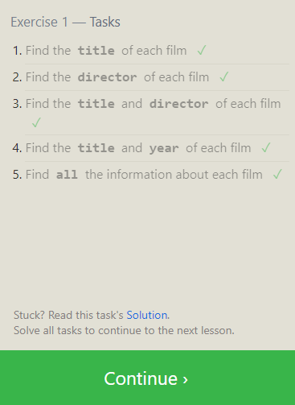
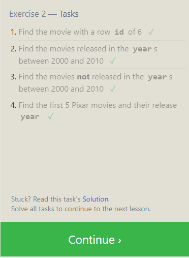
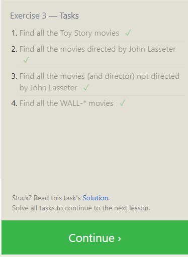
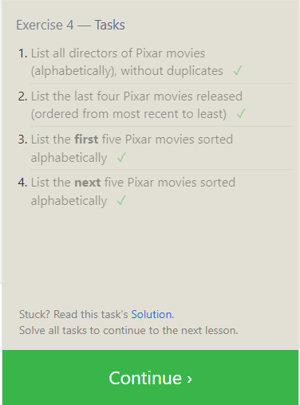
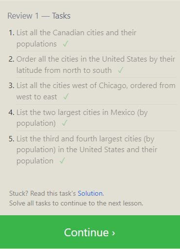
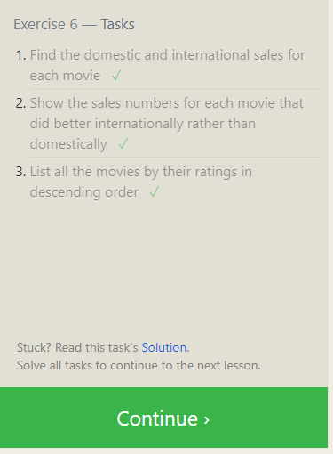
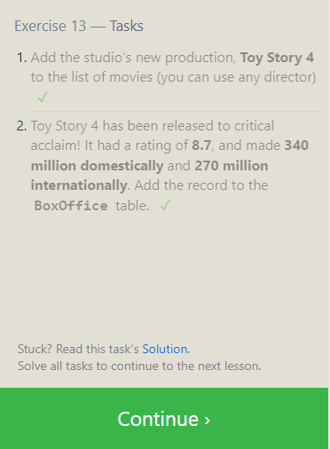
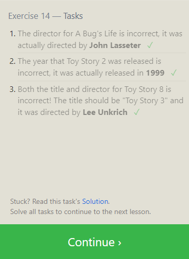
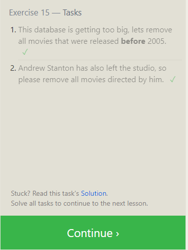
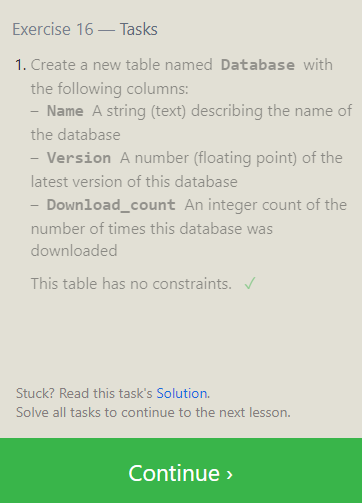
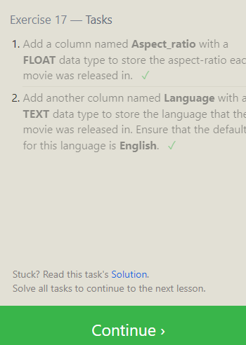
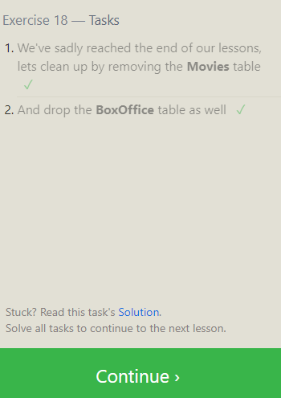